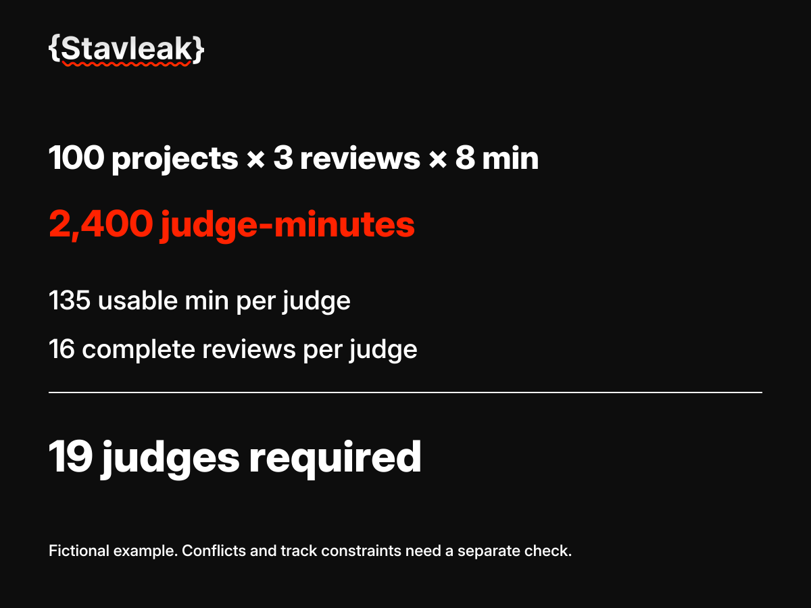

# Judging capacity calculator

[English](docs/en.md) · [Русский](docs/ru.md)

Estimate how many complete project reviews fit into a judging window. Local Node.js CLI, no dependencies and no network requests.

Рассчитайте, сколько полных проверок проектов помещается в окно судейства. Локальная утилита Node.js без зависимостей и сетевых запросов.



## Quick start / Быстрый запуск

Node.js 22 or later / Node.js 22 или новее:

```sh
node calculate.mjs example.json
node --test calculate.test.mjs
```

The fictional example has 100 projects, three reviews per project and eight minutes per review. Twelve judges each have a three-hour window, with 75% reserved for actual reviews. They can complete 192 reviews, enough for 64 projects. The same assumptions require at least 19 judges when each review must fit completely inside the window.

В условном примере 100 проектов, три проверки на проект и восемь минут на проверку. У 12 членов жюри по три часа, 75% времени отведено на проверки. Вместимость: 192 проверки, то есть 64 проекта. При тех же вводных для 100 проектов нужны минимум 19 членов жюри, если каждая проверка целиком помещается в окно.

## Boundaries / Границы расчёта

This is a workload estimate. It does not assign judges, resolve conflicts of interest, normalize scores or certify fairness. `arithmeticFeasible` only means the counts fit under the stated assumptions. Jury availability by track and conflict constraints need a separate assignment check.

Это оценка нагрузки. Утилита не распределяет проекты, не разрешает конфликты интересов, не нормализует оценки и не подтверждает справедливость. `arithmeticFeasible` означает только, что количества помещаются при заданных допущениях. Доступность жюри по трекам и конфликты нужно проверить отдельно.

Related / Рядом: [jury calibration kit](https://github.com/Stavleak/hackathon-jury-calibration-kit), [organizer kit](https://github.com/Stavleak/hackathon-organizer-kit).

[Contributing / Участие](CONTRIBUTING.md) · [MIT license](LICENSE)
